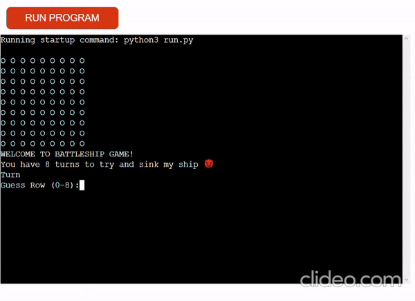

# Super Awesome Battleship - THE GAME

## Description  

 A retro-looking, simple battleship game.
It is a Python terminal game. Made to look and feel like one those first games.
The goal is to guess the location the battleship. The player has only 10 turns to do so.
It is aimed at any specific audience. Any one can enjoy!

### Features

- The grid
  - It is 8*8
  - The Os represent the rows and columns or the ocean
.png)

- Welcome message
  - A brief welcome message will appear welcoming the player
  - And also a brief message mentioning how many turns the player has 
.png)

- Error messages
  - Error message will appear if the player enter a value that is a number
.png)

### How to play
The game is very easy to play. Requires very minimal controls. The player simply types numbers.
- The player starts the game with 10 turns or guess
- The game will first ask the player to guess the row, it only accepts inputs of 0-8, then it will ask the player to guess the column.
- If the player guesses the same combination a message will pop saying "You guessed that one already." and they will lose one turn
- The game ends when the player runs out of turns or when they guess correctly the location of the battleship and sink it.
- The player will have the option to play again, by typing 'yes' or 'no'.
  

### Bugs & Fixes
I have manually tested the game and these are the following bugs I've encountered: 
- Guess_row infinity loop
  - Even if the player inputs numbers, it will keep asking for input. The player will have to press "enter" twice for the loop to stop and continue.
    - I have not been able to find a fix for this bug

- 'yes' or 'no' bug
  - In order for the function it the player will either have to type 'yes' or 'no' without space. Which looks weird.
  - The bug was fixed by simply fixing a small typo in the code
.png)

### Planning & Design

For the game, I wanted to go full-on old school. Just a simple grid with Xs and Os.
- The logic of the game was dumb down, make as simple as possible so it will be easier to build into as the project progessed.

## Validator testing
- PEP8 was used to validate the code
  - It return no erros
.png)

## Deployment
The below steps were followed to deploy this project to Heroku:

- Go to Heroku and click "New" to create a new app.
- After choosing the app name and setting the region, press "Create app".
- Go to "Settings" and navigate to Config Vars. Add a Config Var with a key word of called PORT and a value of 8000.
- Still in the "Settings", navigate to Buildpacks and add buildpacks for Python and NodeJS. They have to be in order, Python first, then NodeJS.
- Go to "Deploy". Scroll down and set Deployment Method to GitHub. Once GitHub is chosen, find your repository and connect it to Heroku.
- Scroll down to Manual Deploy, make sure the "main" branch is selected and click "Deploy Branch".
- The deployed app can be found here.

## Credit

### Programs used
 - Heroku was used to deploy the game to the web.
 - Xbox Games Bar was used to record the screen and then used clideo.com was used to crop and convert my video
 - LucidChart was used to create the flow chart

#### Notetaking & Planning

- Obsidian
  - It is an interesting productivity application. It is a Markdown-based system that incorporates tags, plugins, and back-links to create a compelling to use the system. Great tool for note-taking and planning out projects. Later you can export your notes as PDFs.

#### Langueges used

- Python was used to create the game. 

#### Code 

- Code was inspired by this tutorial <https://www.youtube.com/watch?v=tF1WRCrd_HQ&t=732s> by Knowledge Mavens.
